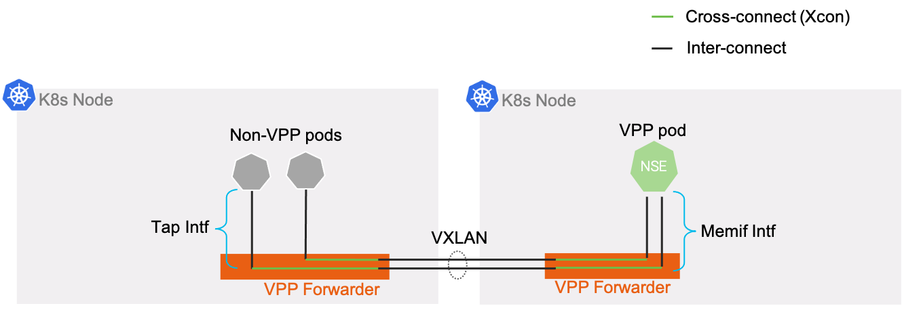

# Correlation Implementation

## Interface Connection Relationships

### Kubernetes Inter-Pod/Node Connections



1. **Inter-connect** is a reference to the relationships between interfaces that are interconnecting 2 pods.
   - Tap interfaces--host network interconnect via Linux kernel tap interface to VPP tap interface
   - Memif interfaces--interconnect via memif interfaces using the same socketfile/shared-mem between VPP pods
   - VXLAN interfaces--interconnect across nodes via the same src/dst IP pair and VNI
    
1. **Cross-connect (Xcon)** refers to the cross-connect of interfaces within a VPP instance.  This is how traffic from interfaces of different types are directly connected.

#### Correlation: Inter-connect Mapping Implementation

The attributes and configuration for all interfaces for discovered VPP instances are normalized to a common format.  For each `NormalizedIfType`, an implementation of the `ForwarderIfNormalizedConfig` interface's `MatchKey()` method generates a string that matches with the value of its inter-connected peer interface.

This is implemented as follows for each `NormalizedIfType`:

- `TAP` -- matching VPP and Linux interface names
- `MEMIF` -- matching socket file path and name for last 2 portions of file path.
- `VXLAN` -- original src/dst IP config is mapped to the full list of k8s node addresses.  The `MatchKey` format is `<srcIP>,<dstIP>/<VNI>` and uses the first IPs in each of the node objects' addresses list, with the src IP equal to the lexigraphically smallest of the 2 node addresses.
  - NOTE: the reason this is necessary is to work for public cloud nodes with Node SNAT functionality to public addresses.  Using the k8s node object info in this way should work for all known k8s cases.
    
To correlate interfaces' configuration to their inter-connect peers, the `IfInterconnects` map is used:

```go
// pairs of interconnect intfs map[type][IfMatchkey]{ forwarderIf1, forwarderIf2 }
IfInterconnects map[NormalizedIfType]map[string][]*ForwarderIf
```

Interfaces with matching `MatchKey()` output are inter-connect pairs and get mapped to the same slice. 

#### Correlation: Cross-connect Mappings

The `IfXconnects` map associates interfaces to their crossconnect peer interface:

```go
// map[pod][ifName] = xconn peer ifName
IfXconnects map[string]map[string]string
```

The VPP instance config's xconnect info is used to build this map.

#### Correlation: Full Connection Path

The endpoints to the full connection paths are Linux pod TAP interfaces or VPP MEMIF interfaces that are not part of a VPP crossconnect.  The correlation starts at interfaces fitting these criteria and traverses the inter-connect and cross-connect relationships at each interface to creates a `ForwarderConnection` object for the full paths.  While traversing the interfaces, they are associated (marked) with the connection they are a part of.

Any "leftover" VXLAN interfaces are considered dangling but are also attempted to be associated to their inter-connect peer for display.
